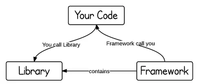

## Assignment 1.

#### Clientside
Anything that is displayed to the end user. This includes what the user sees, such as text, images, and the rest of the UI, along with any actions that an application performs within the user's browser.


#### Serverside
Anything happening on the web server is serverside. From complex calculations, to database handling line adding, deleting, etc.

#### [Also found this pretty elaborate](https://softwareengineering.stackexchange.com/questions/171203/what-are-the-differences-between-server-side-and-client-side-programming)
---
#### HTTP Protocol
HTTP Protocol allows the fetching of resources, such as HTML documents, images, etc. It basically sets up rules to request to and from the web server.

---
#### HTTP vs HTTPS
| HTTP                                                      	| HTTPS                                         	|
|-----------------------------------------------------------	|-----------------------------------------------	|
| Governs how any information can be transmitted on the WWW 	| Highly advanced and secure version of HTTP    	|
| No explicit encryption                                    	| Encrypts entire communication with SSL or TLS 	|
| Default operates on port 80                               	| Default operates on port 443                  	|

---
#### Frameworks vs Libraries
<p align="center">
  
</p>

| Framework                          	| Library                                 	|
|------------------------------------	|-----------------------------------------	|
| Contains predefined code template. 	| Collection of class definitions.        	|
| Normally more complex.             	| Simpler, straightforward chunk of code. 	|
| Has a broad scope for application. 	| Relatively narrower scoped.             	|

---

**Shell commands used:**
```shell
mkdir - making folder
cd - to change folder
touch - to create the readme file
ls - to view the contents of the folder
mv - for moving contents from one folder to another (also for renaming)
rm - delete file
cp - copy file

# And some git commands mentioned in the Alternative.
```
